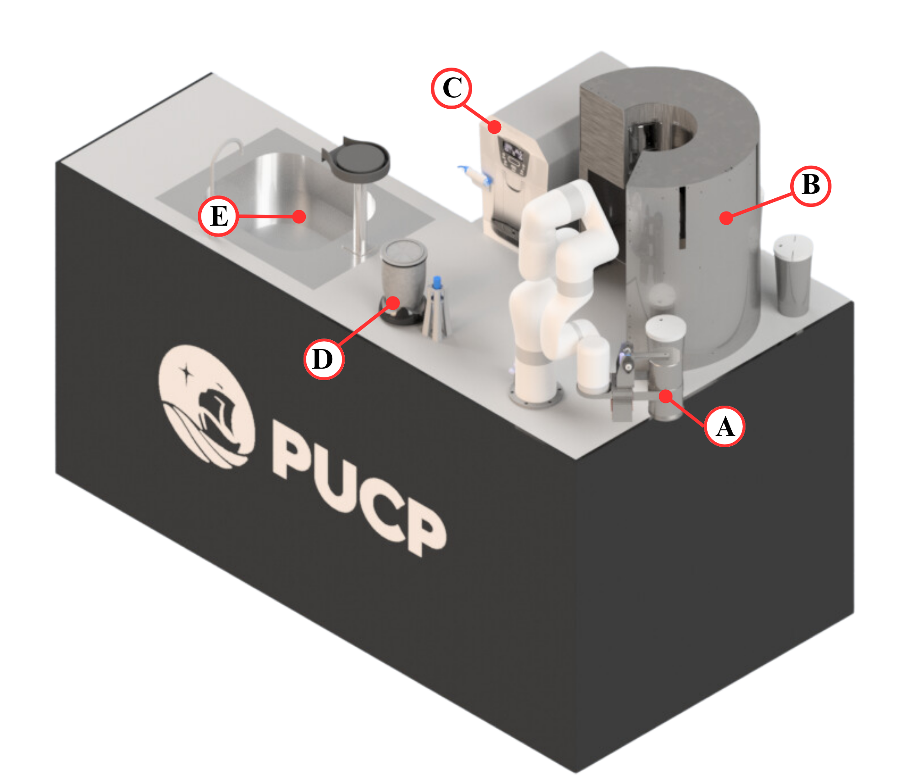
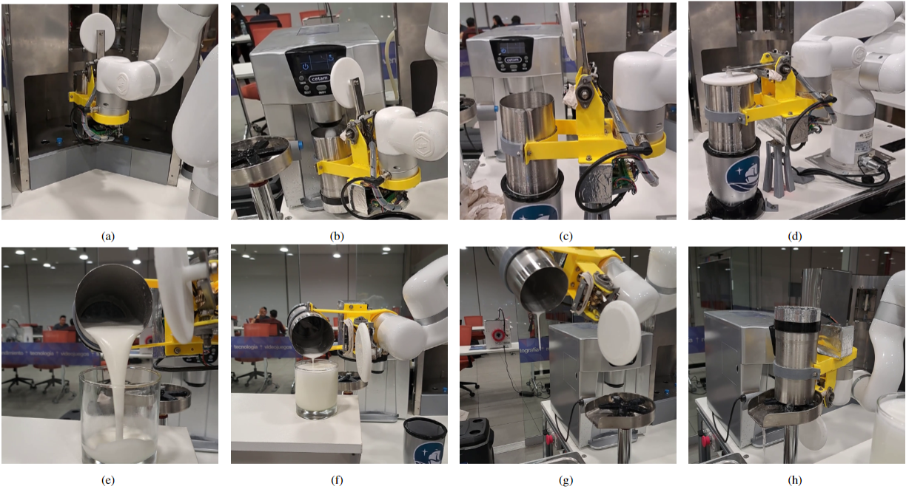

# Robotic Bartender 
A Robot Bartender was implemented using a Ufactory Xarm robotic arm. 

# Robotic Bartender Station
The station is divided into the following subsystems:
a) Gripper mechanism.
b) Ingredients dispenser.
c) Ice  dispenser. 
d) Mix in blender 
e) Automatic washing.

  
 
## Pisco Sour preparation routine

A preparation routine was implemented using the robotic arm and the previously mentioned subsystems. The routine begins with the dispensing of ingredients into the metal glass as shown in (a), then the glass is placed next to the outlet of the ice maker to obtain ice as shown in (b). With all the ingredients inside the metal glass, the mixing process is performed using the blender as shown in (c). In Figure (d) it is observed that to avoid splashes, the stepper motor is activated, allowing the metal glass to be covered. Once the mixing process is complete, the Pisco Sour is served in a glass located in the serving area as shown in Figure (e). For a correct serving of the Pisco Sour, it must be done in three stages, allowing the foam formed by the egg white to remain on top of the serving glass. Between each serving, a brief circular movement is made with the robotic arm to beat the mixture again. In the third serving, the presence of foam is evident in the upper part of the glass as shown in Figure (f). Finally, the leftover mixture is thrown into the sink and the glass is rinsed using pressurized water as shown in Figure (g) and (h) respectively.
  
